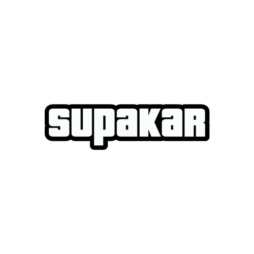
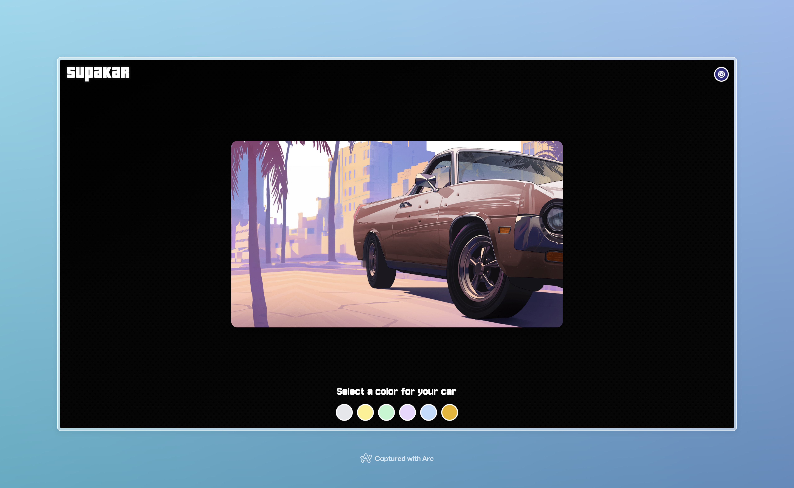

# Suparkar

## Description

Ce projet est une initiation à la conception d'interface avec React JS. Sur le thème de l'emblématique jeu vidéo GTA San Andreas, il s'agit de créer une interface de personnalisation d'un véhicule. L'utilisateur peut choisir la couleur de la carrosserie en temps réel.

  

## Installation

1. Cloner le projet
2. Installer les dépendances avec `npm install` ou `pnpm install`
3. Lancer le projet avec `npm run dev`

## Technologies

-   Vite JS
-   React JS
-   Tailwind CSS

## Résultats attendus

Voici le rendu attendu :

1. Au clic sur une couleur, la couleur de la carrosserie doit changer en temps réel.
2. À chaque clic un son doit être joué pour la sélection puis un second son pour le changement de couleur.
3. Le boutton en haut à droite doit permettre de lancer la musique de fond du jeu.

## Comment rendre le projet ?

1. Créer un repository sur votre compte GitHub
2. Pousser le code sur ce repository
3. Héberger le projet sur Vercel ou Netlify
4. Envoyer le lien du repository et le lien du projet hébergé sur Vercel ou Netlify par mail à l'adresse suivante : `hello[at]agiliteach.org`
5. Un feedback te sera envoyé par la suite.

Happy coding! 🚀
